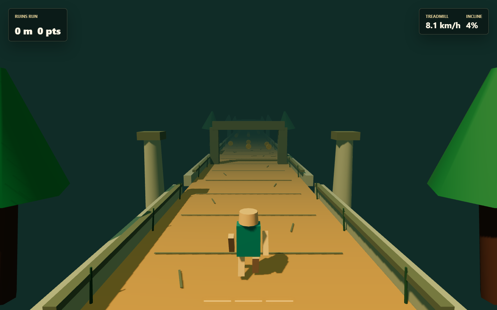

# Ruins Run

A browser-based 3D endless runner built with React, Three.js, and TypeScript. Dodge obstacles, collect coins, and see how far you can go through an ancient temple ruin.



## Installation

**Prerequisites:** Node.js 18+ and [pnpm](https://pnpm.io/installation)

```bash
pnpm install
```

## Running

```bash
pnpm dev
```

Open [http://localhost:5173](http://localhost:5173) in your browser. Click or press any key to start the audio, then play.

To build for production:

```bash
pnpm build
pnpm preview   # serve the built output locally
```

## How to Play

Your runner moves forward automatically. Your job is to dodge obstacles and collect coins.

### Controls

|  Action   | Keyboard              | Touch                          |
|-----------|-----------------------|--------------------------------|
| Move left  | `←` or `A`           | Tap left third of screen       |
| Move right | `→` or `D`           | Tap right third of screen      |
| Jump       | `↑`, `W`, or `Space` | Tap top third of screen        |
| Slide      | `↓` or `S`           | Tap centre of screen           |

### Obstacles

| Obstacle | How to clear |
|----------|--------------|
| 🔥 Fire pit | **Jump** over it |
| 🪨 Stone barrier | **Jump** over it |
| 🌿 Limbo vine | **Slide** under it |

Each obstacle shows a visual cue: yellow chevrons mean jump, cyan chevrons mean slide.

### Scoring

- Collecting a coin: **+10 pts**
- The game speeds up gradually as you run further — there's no finish line.

## Development

```bash
pnpm lint    # run ESLint
```
